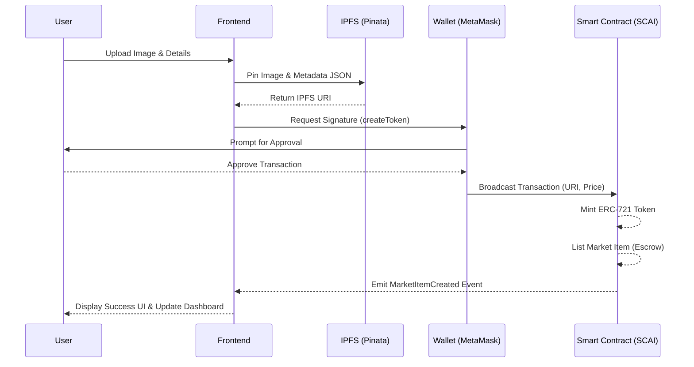

# Provenance Protocol

Welcome to the **Provenance Protocol**, a full-stack, decentralized NFT Marketplace engineered specifically for the SCAI Mainnet.

Built with a rigorous focus on security, gas efficiency, and premium user experience, this platform facilitates the seamless minting, listing, discovery, and purchasing of non-fungible tokens (NFTs) in a completely decentralized environment.

---

## 🚀 Deployment Details

The smart contracts for the Provenance Protocol are deployed directly on the **SCAI Mainnet**.

* **Smart Contract Address:** `[Placeholder: Insert SCAI Mainnet Contract Address Here]`
* **Live Demo (Vercel):** [https://provenance-protocol.vercel.app](https://provenance-protocol.vercel.app) *(Update link upon final Vercel deployment)*

---

## 🎯 Project Requirements & Use Cases

### Core Functional Requirements
* **Minting Engine:** Users can upload digital assets (images, artwork) directly to IPFS, receiving a verifiable ERC-721 token in return.
* **Fixed-Price Listing:** NFT owners can securely list their assets on the marketplace at a fixed price in native cryptocurrency.
* **Wallet Integration:** Seamless connection with Web3 wallets (MetaMask, WalletConnect) using Ethers.js to facilitate secure transaction signing.
* **Marketplace Mechanics:** Automated transfer of ownership and funds via smart contract execution, with built-in listing fees directed to the protocol owner.

### Real-World Use Cases
1. **Digital Art & Collectibles:** Artists can independently tokenize and monetize their digital creations without relying on centralized intermediaries.
2. **Gaming Assets:** Integration of in-game items as NFTs, allowing players true ownership and the ability to trade assets on a secondary market.
3. **Digital Identity & Credentials:** Issuance of verifiable, non-transferable certificates (if modified to Soulbound tokens) or transferable access passes for exclusive communities.

---

## 📊 Competitive Analysis

While the Web3 ecosystem features numerous NFT marketplaces (e.g., OpenSea, Blur) and staking platforms, the Provenance Protocol distinguishes itself through its targeted architecture for the SCAI Mainnet:

* **SCAI Mainnet Specialization:** By deploying natively on the SCAI Mainnet, the protocol capitalizes on the network's specific consensus mechanisms and lower latency compared to congested Layer 1 networks like Ethereum.
* **Aggressive Gas Optimization:** Unlike bloated legacy protocols that accrue technical debt over years of iterative updates, Provenance utilizes custom errors (instead of standard `require` string reverts) and tight state variable packing. This translates to significantly lower transaction costs for end-users during minting and trading.
* **Architectural Simplicity:** We avoid overly complex, unneeded features (like complex bidding wars or proxy implementations) in favor of a straightforward, hyper-secure, fixed-price model. This reduces the smart contract attack surface and ensures greater reliability.

---

## 🏗️ System Architecture & Logic

### Smart Contract Logic
The core protocol is governed by `NFTMarketplace.sol`, a unified smart contract combining ERC-721 standard functionality with robust market logic.

* **ERC-721 Implementation:** Inherits from OpenZeppelin's extensively audited `ERC721URIStorage` to manage token ownership, metadata URIs, and transfers securely.
* **State Transitions:** 
  * `Minting`: A user mints an NFT. A new token ID is generated, the IPFS URI is bound to it, and ownership is assigned to the creator.
  * `Listing`: The token owner calls `createToken`. The contract transfers the NFT from the user to the contract itself, holding it in escrow. The item state becomes `Listed`.
  * `Sale Execution`: A buyer calls `createMarketSale` with the required value. The contract automatically routes the listing fee to the marketplace owner, transfers the purchase price to the seller, and transfers the NFT to the buyer. The state resolves to `Sold`.

### Application Workflow

**User ➡️ Frontend ➡️ Wallet ➡️ Smart Contract ➡️ IPFS**

1. **User Interaction:** The user interacts with the React-based frontend dashboard.
2. **Metadata Upload:** When minting, the frontend uploads the digital asset and JSON metadata to IPFS via Pinata.
3. **Wallet Approval:** The frontend constructs the transaction data and prompts the user's Web3 wallet to sign the transaction.
4. **Smart Contract Execution:** The signed transaction is broadcasted to the SCAI Mainnet, invoking the specific functions in the `NFTMarketplace` contract.
5. **State Update:** The blockchain state is updated, emitting events that the frontend listens to in order to update the UI.

### Workflow Diagram



---

## 🛠️ Technology Stack

* **Smart Contracts:** Solidity (^0.8.20), Hardhat, OpenZeppelin (ERC-721, ReentrancyGuard)
* **Frontend:** React.js (Vite), TailwindCSS
* **Web3 Integration:** Ethers.js v6
* **Storage:** IPFS via Pinata API

---

## 💻 Technical Documentation: Local Development Setup

To test, modify, or deploy the protocol locally, follow these steps.

### 1. Clone the Repository
```bash
git clone https://github.com/Krrish41/provenance-protocol.git
cd provenance-protocol
```

### 2. Smart Contracts Setup & Testing
Navigate to the contracts directory and install dependencies:
```bash
cd contracts
npm install
```

Set up your environment variables (`contracts/.env`):
```env
SCAI_RPC_URL="your_scai_mainnet_rpc_url"
PRIVATE_KEY="your_deployment_wallet_private_key"
```

Compile and execute the automated test suite to ensure contract integrity:
```bash
npx hardhat test
```

*(Optional)* Run a local Hardhat node and deploy:
```bash
npx hardhat node
# In a new terminal:
npx hardhat run scripts/deploy.js --network localhost
```

### 3. Frontend Setup
Navigate to the frontend directory:
```bash
cd ../frontend
npm install
```

Configure your environment variables (`frontend/.env`):
```env
VITE_PINATA_API_KEY="your_pinata_api_key"
VITE_PINATA_SECRET_KEY="your_pinata_secret_key"
VITE_MARKETPLACE_ADDRESS="deployed_contract_address"
```

Start the local development server:
```bash
npm run dev
```

---

## 🔒 Security Summary

- **Reentrancy Protection:** All state-changing functions that process value transfers use OpenZeppelin's `ReentrancyGuard` (`nonReentrant` modifier).
- **Escrow Mechanism:** NFTs are safely held in the contract during the listing phase to ensure atomic swaps between the buyer and the seller.

## 📄 License
This project is licensed under the MIT License.
