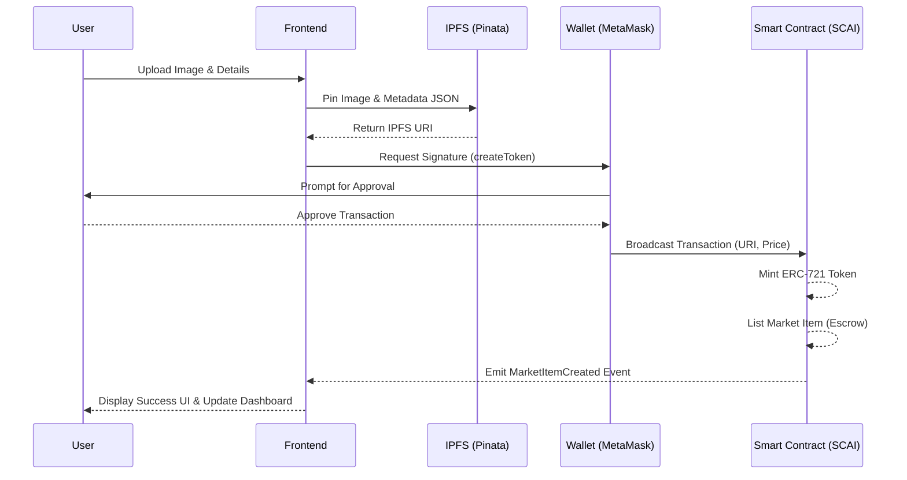

# Provenance Protocol

The **Provenance Protocol** is a full-stack, decentralized NFT Marketplace engineered specifically for the SCAI Mainnet.

Built with a rigorous focus on security, gas efficiency, and optimized user experience, this platform facilitates the seamless minting, listing, discovery, and purchasing of non-fungible tokens (NFTs) in a completely decentralized environment.

---

## Deployment Details

The smart contracts for the Provenance Protocol are deployed directly on the **SCAI Mainnet**.

* **Smart Contract Address:** `0x5Adc8E4034d032AF392c2C6cB508fF05D781e5c4`
* **Live Demo (Vercel):** [https://provenance-protocol.vercel.app](https://provenance-protocol.vercel.app)

---

## Project Requirements and Use Cases

### Core Functional Requirements
* **Minting Engine:** Facilitates the upload of digital assets to IPFS and the subsequent issuance of verifiable ERC-721 tokens.
* **Fixed-Price Listing:** Enables NFT owners to securely list assets on the marketplace at a fixed price in native cryptocurrency.
* **Wallet Integration:** Provides secure connection with Web3 wallets (MetaMask, WalletConnect) using Ethers.js for transaction signing.
* **Marketplace Mechanics:** Implements automated transfer of ownership and funds via smart contract execution, with built-in listing fees directed to the protocol owner.

### Real-World Use Cases
1. **Digital Art and Collectibles:** Allows creators to independently tokenize and monetize digital assets without centralized intermediaries.
2. **Gaming Assets:** Supports the integration of in-game items as NFTs, enabling true ownership and secondary market trading.
3. **Digital Identity and Credentials:** Facilitates the issuance of verifiable certificates or access passes for exclusive digital communities.

---

## Competitive Analysis

The Provenance Protocol is architected to leverage the specific advantages of the SCAI Mainnet compared to traditional Web3 marketplaces:

* **SCAI Mainnet Specialization:** Native deployment on the SCAI Mainnet utilizes the network's consensus mechanisms and low latency, avoiding the congestion common on Layer 1 networks.
* **Aggressive Gas Optimization:** The protocol utilizes custom errors and optimized state variable packing to significantly reduce transaction costs during minting and trading operations.
* **Architectural Simplicity:** The protocol prioritizes a hyper-secure, fixed-price model to minimize the smart contract attack surface and ensure operational reliability.

---

## System Architecture and Logic

### Smart Contract Logic
The core protocol is governed by `NFTMarketplace.sol`, a unified smart contract combining ERC-721 standard functionality with market logic.

* **ERC-721 Implementation:** Inherits from `ERC721URIStorage` to manage token ownership and metadata URIs.
* **State Transitions:** 
  * `Minting`: A new token ID is generated and the IPFS URI is bound to it.
  * `Listing`: The contract takes custody of the NFT (escrow) and sets the state to `Listed`.
  * `Sale Execution`: Upon payment, the contract executes an atomic swap, transferring funds to the seller and the NFT to the buyer.

### Application Workflow

**User | Frontend | Wallet | Smart Contract | IPFS**

1. **User Interaction:** The user interacts with the React-based frontend dashboard.
2. **Metadata Upload:** The frontend uploads the digital asset and JSON metadata to IPFS via Pinata.
3. **Wallet Approval:** The frontend constructs the transaction data and prompts the user's wallet for signature.
4. **Smart Contract Execution:** The transaction is broadcasted to the SCAI Mainnet, invoking the `NFTMarketplace` contract.
5. **State Update:** The blockchain state is updated, and the frontend reflects the changes via event listeners.

### Workflow Diagram



---

## Technology Stack

* **Smart Contracts:** Solidity (^0.8.20), Hardhat, OpenZeppelin (ERC-721, ReentrancyGuard)
* **Frontend:** React.js (Vite), TailwindCSS
* **Web3 Integration:** Ethers.js v6
* **Storage:** IPFS via Pinata API

---

## Technical Documentation: Local Development Setup

Follow these steps to test or deploy the protocol locally.

### 1. Clone the Repository
```bash
git clone https://github.com/Krrish41/provenance-protocol.git
cd provenance-protocol
```

### 2. Smart Contracts Setup
Navigate to the contracts directory and install dependencies:
```bash
cd contracts
npm install
```

Configure environment variables in `contracts/.env`:
```env
SCAI_RPC_URL="your_scai_mainnet_rpc_url"
PRIVATE_KEY="your_deployment_wallet_private_key"
```

Execute the test suite:
```bash
npx hardhat test
```

### 3. Frontend Setup
Navigate to the frontend directory and install dependencies:
```bash
cd ../frontend
npm install
```

Configure environment variables in `frontend/.env`:
```env
VITE_PINATA_API_KEY="your_pinata_api_key"
VITE_PINATA_SECRET_KEY="your_pinata_secret_key"
VITE_MARKETPLACE_ADDRESS="deployed_contract_address"
```

Start the development server:
```bash
npm run dev
```

---

## Security Summary

* **Reentrancy Protection:** All state-changing functions utilize the `ReentrancyGuard` modifier to prevent recursive attacks.
* **Escrow Mechanism:** NFTs are held in the contract during the listing phase to ensure secure, atomic swaps.

## License
This project is licensed under the MIT License.
